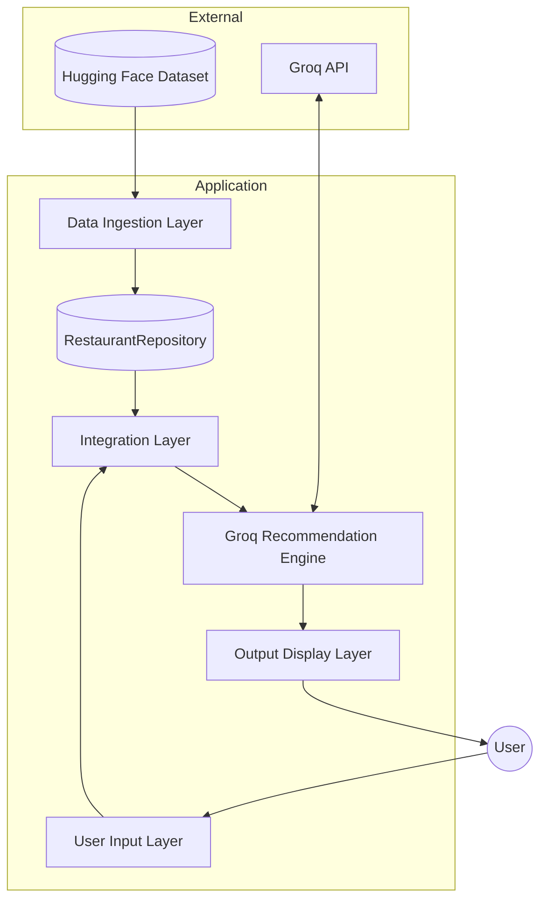
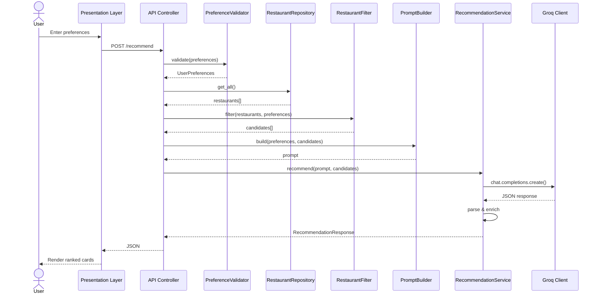
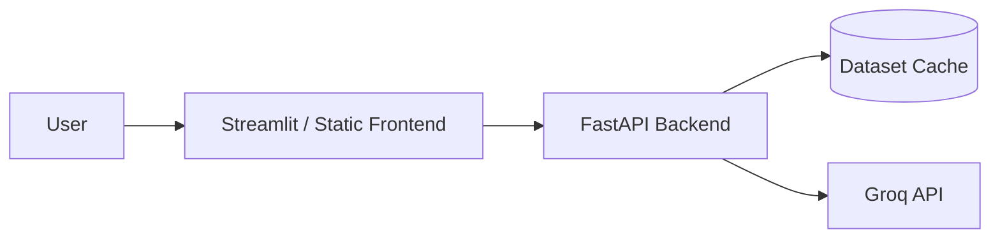

# Architecture: AI-Powered Restaurant Recommendation System

This document describes the **technical architecture** for the Zomato-inspired restaurant recommendation service defined in [context.md](./context.md). The system combines structured restaurant data from Hugging Face with **Groq** inference to produce personalized, explainable recommendations.

---

## LLM Provider: Groq

> **Official LLM provider for this project: [Groq](https://groq.com/)**
>
> All ranking, explanation, and summarization tasks are handled exclusively through the Groq API. No other LLM providers (OpenAI, Anthropic, Azure OpenAI, local Ollama, etc.) are used or supported in this codebase.

| Item | Value |
|------|-------|
| **Provider** | Groq |
| **SDK** | [`groq`](https://pypi.org/project/groq/) (official Python client) |
| **Primary model** | `llama-3.3-70b-versatile` |
| **Fallback model** | `llama-3.1-8b-instant` |
| **API key env var** | `GROQ_API_KEY` |
| **Adapter module** | `src/services/groq_client.py` → `GroqClient` |

The Groq adapter is the **only** path from application code to an LLM. UI, API, and service layers must call `GroqClient` (via `RecommendationService`) — never a generic or swappable multi-provider client.

---

## Table of Contents

0. [LLM Provider: Groq](#llm-provider-groq)
1. [Architecture Goals](#1-architecture-goals)
2. [High-Level System Overview](#2-high-level-system-overview)
3. [Component Architecture](#3-component-architecture)
4. [Data Models & Schemas](#4-data-models--schemas)
5. [Integration Layer](#5-integration-layer)
6. [Recommendation Engine (Groq)](#6-recommendation-engine-groq)
7. [Output Display Layer](#7-output-display-layer)
8. [Request Flow](#8-request-flow)
9. [Module Structure](#9-module-structure)
10. [Technology Stack](#10-technology-stack)
11. [API Design](#11-api-design)
12. [Configuration Management](#12-configuration-management)
13. [Cross-Cutting Concerns](#13-cross-cutting-concerns)
14. [Deployment Topology](#14-deployment-topology)
15. [Testing Strategy](#15-testing-strategy)
16. [Implementation Phases](#16-implementation-phases)
17. [Architecture Decision Records](#17-architecture-decision-records)
18. [Related Documents](#18-related-documents)

---

## 1. Architecture Goals

| Goal | Description |
|------|-------------|
| **Separation of concerns** | Data loading, filtering, Groq inference, and presentation are isolated modules with clear interfaces. |
| **Deterministic pre-filtering** | Hard constraints (location, budget, rating) are applied in code **before** Groq to reduce token cost and hallucination risk. |
| **Explainability** | Every recommendation includes a Groq-generated rationale tied to user preferences. |
| **Extensibility** | Swap UI frameworks or data sources without rewriting core logic; Groq access is isolated behind `GroqClient`. |
| **Testability** | Pure functions for filtering/ranking prep; mockable `GroqClient` for unit and integration tests. |

---

## 2. High-Level System Overview

The system follows a **pipeline architecture** with five logical layers. Data flows top-down at startup (ingestion) and left-to-right per request (recommendation).



### Layer Responsibilities

| Layer | Primary Responsibility | Key Components |
|-------|------------------------|----------------|
| Data Ingestion | Load, normalize, cache dataset | `DatasetLoader`, `DataPreprocessor`, `RestaurantRepository` |
| User Input | Collect and validate preferences | `PreferenceForm`, `PreferenceValidator`, `PreferenceNormalizer` |
| Integration | Filter candidates, build Groq prompt | `RestaurantFilter`, `CandidateSelector`, `PromptBuilder` |
| Groq Recommendation Engine | Invoke Groq API, parse, enrich results | `GroqClient`, `RecommendationService`, `ResponseParser` |
| Output Display | Render results to user | `RecommendationPresenter`, `ResultsView` |

---

## 3. Component Architecture

### 3.1 Data Ingestion Layer

**Responsibility:** Load, normalize, and cache the Zomato dataset once at startup (or on first request).

| Component | Role |
|-----------|------|
| `DatasetLoader` | Fetches `ManikaSaini/zomato-restaurant-recommendation` via Hugging Face `datasets` library. |
| `DataPreprocessor` | Maps raw columns to canonical schema; handles nulls; normalizes text fields. |
| `RestaurantRepository` | In-memory query interface over the preprocessed dataset. |

#### DatasetLoader

```python
class DatasetLoader:
    def load(self, dataset_name: str, split: str = "train") -> pd.DataFrame:
        """Download or load cached raw dataset from Hugging Face."""
        ...

    def load_from_cache(self, cache_path: Path) -> pd.DataFrame | None:
        """Load preprocessed snapshot if available."""
        ...
```

**Behavior:**

- On first run: download from Hugging Face with retry + exponential backoff.
- On subsequent runs: prefer local parquet/CSV cache at `DATA_CACHE_PATH`.
- Log download duration and row count.

#### DataPreprocessor

```python
class DataPreprocessor:
    def preprocess(self, raw_df: pd.DataFrame) -> list[Restaurant]:
        """Transform raw DataFrame into canonical Restaurant objects."""
        ...
```

**Preprocessing pipeline (ordered steps):**

1. Select and rename relevant columns to canonical schema.
2. Parse cuisine strings into lists (`"Italian, Chinese"` → `["Italian", "Chinese"]`).
3. Coerce `rating` and `cost_for_two` to numeric; drop rows with invalid critical fields.
4. Normalize location strings (trim, title-case, apply city alias map).
5. Derive `budget_tier` from `cost_for_two` using configurable thresholds.
6. Assign stable string `id` (dataset index or explicit ID column).

**Budget tier derivation:**

| Tier | `cost_for_two` range (INR) |
|------|----------------------------|
| `low` | ≤ 500 |
| `medium` | 501 – 1500 |
| `high` | > 1500 |

> Tune thresholds after inspecting actual dataset distribution during Phase 1.

#### RestaurantRepository

```python
class RestaurantRepository:
    def __init__(self, restaurants: list[Restaurant]): ...

    def get_all(self) -> list[Restaurant]: ...
    def get_by_id(self, restaurant_id: str) -> Restaurant | None: ...
    def get_distinct_locations(self) -> list[str]: ...
    def get_distinct_cuisines(self) -> list[str]: ...
    def count(self) -> int: ...
```

**Caching strategy:**

- Load once into memory as `list[Restaurant]` (backed optionally by pandas for bulk ops).
- Persist preprocessed snapshot to `./data/restaurants.parquet` (gitignored).
- Repository is a **singleton** initialized at application startup.

---

### 3.2 User Input Layer

**Responsibility:** Collect, validate, and normalize user preferences before they enter the filter pipeline.

| Component | Role |
|-----------|------|
| `PreferenceForm` | UI form (Streamlit) or CLI prompt collecting preference fields. |
| `PreferenceValidator` | Enforces required fields, enum values, and rating bounds. |
| `PreferenceNormalizer` | Lowercases cuisine, maps city aliases, trims free text. |

#### Validation Contract

| Field | Rule | Error Handling |
|-------|------|----------------|
| `location` | Non-empty; must exist in dataset (case-insensitive) | Return 400 + list of valid locations |
| `budget` | One of `low`, `medium`, `high` | Return 400 with allowed values |
| `min_rating` | Float in `[0.0, 5.0]` | Return 400 with valid range |
| `cuisine` | Optional; fuzzy match against dataset vocabulary | Warn if no close match; pass through for LLM |
| `additional` | Optional free text, max 500 chars | Truncate with warning if exceeded |

#### PreferenceNormalizer

- Trim whitespace on all string fields.
- Title-case location after alias resolution (e.g. `"bangalore"` → `"Bangalore"`).
- Lowercase cuisine for filter matching; preserve original for display in prompt.

---

### 3.3 Integration Layer

**Responsibility:** Apply hard filters, rank candidates heuristically, and assemble the Groq LLM prompt. This layer ensures the model only reasons over a **bounded, relevant candidate set**.

#### 3.3.1 RestaurantFilter

```python
class RestaurantFilter:
    def filter(
        self,
        restaurants: list[Restaurant],
        preferences: UserPreferences,
    ) -> FilterResult:
        """
        Returns filtered candidates and metadata about applied/relaxed filters.
        """
        ...
```

**Filter pipeline (sequential):**

```
all restaurants
  → filter by location (case-insensitive exact match)
  → filter by budget tier
  → filter by min_rating
  → filter by cuisine (if provided; partial match in restaurant.cuisines)
  → sort by rating DESC, then votes DESC
  → take top N candidates (MAX_CANDIDATES_FOR_LLM, default 15–20)
```

**Constraint relaxation** (when zero candidates):

| Order | Constraint Relaxed | User Notification |
|-------|-------------------|-------------------|
| 1 | `cuisine` | "No {cuisine} restaurants found; showing all cuisines in {location}" |
| 2 | `budget` | "Expanded budget range to include nearby tiers" |
| 3 | `min_rating` | "Lowered minimum rating to {new_threshold}" |

Relaxation stops as soon as candidates > 0. All relaxations are recorded in `FilterResult.relaxed_constraints`.

#### 3.3.2 CandidateSelector

- Caps result count at `MAX_CANDIDATES_FOR_LLM`.
- Tie-breaking: higher `rating` first, then higher `votes`, then alphabetical `name`.

#### 3.3.3 PromptBuilder

```python
class PromptBuilder:
    def build(
        self,
        preferences: UserPreferences,
        candidates: list[Restaurant],
        top_k: int = 5,
    ) -> tuple[str, str]:
        """Returns (system_prompt, user_prompt)."""
        ...
```

**Prompt structure:**

| Section | Content |
|---------|---------|
| System | Role definition, JSON output schema, anti-hallucination rules |
| User — Preferences | Serialized `UserPreferences` |
| User — Candidates | Compact JSON array: `{ id, name, location, cuisines, cost_for_two, rating }` |
| User — Task | Rank top K, explain each, optionally summarize |

**Design principles:**

- Require **JSON-only** output for reliable parsing.
- Include restaurant `id` in every candidate so explanations map back to structured data.
- Instruct model to **only recommend from the provided list** — no fabrication.
- Pass `additional` preferences as soft signals for ranking and explanation.

**Example prompt (conceptual):**

```
[System]
You are a restaurant recommendation assistant for Indian cities.
Rank restaurants from the CANDIDATES list only. Return valid JSON.
Do not invent restaurants. Use only the ids provided.

[User Preferences]
{ "location": "Bangalore", "budget": "medium", "cuisine": "Italian",
  "min_rating": 4.0, "additional": "family-friendly, outdoor seating" }

[Candidates]
[
  { "id": "42", "name": "Example Ristorante", "location": "Bangalore",
    "cuisines": ["Italian", "Continental"], "cost_for_two": 1200, "rating": 4.5 },
  ...
]

[Task]
Return top 5 restaurants as JSON:
{
  "summary": "...",
  "recommendations": [
    { "id": "42", "rank": 1, "explanation": "..." }
  ]
}
```

---

### 3.4 Recommendation Engine (Groq LLM Layer)

**Responsibility:** Invoke Groq, handle retries, parse and validate the response, merge with structured data.

| Component | Role |
|-----------|------|
| `GroqClient` | **Groq-only** adapter over the Groq chat completions API via the official `groq` Python SDK. |
| `RecommendationService` | Orchestrates prompt → Groq → parse → enrich. |
| `ResponseParser` | Parses Groq JSON output; validates schema; handles malformed output. |
| `RecommendationEnricher` | Joins Groq ranks/explanations with full restaurant records. |

#### RecommendationService Orchestration

```python
class RecommendationService:
    def recommend(
        self,
        preferences: UserPreferences,
        repository: RestaurantRepository,
    ) -> RecommendationResponse:
        candidates = self.filter.filter(repository.get_all(), preferences)
        system_prompt, user_prompt = self.prompt_builder.build(
            preferences, candidates.restaurants
        )
        raw_response = self.groq_client.complete(system_prompt, user_prompt)
        parsed = self.parser.parse(raw_response)
        return self.enricher.enrich(parsed, candidates.restaurants)
```

#### Reliability Patterns

| Pattern | Trigger | Action |
|---------|---------|--------|
| Structured JSON output | Always | `response_format={"type": "json_object"}` when model supports it |
| Retry with lower temperature | Invalid JSON on first attempt | Retry once at `temperature=0.1` |
| Exponential backoff | Groq 429 rate limit | Wait 1s → 2s → 4s, max 3 retries |
| Fallback ranking | All Groq attempts fail | Return heuristic top-K by rating with generic explanation |
| Idempotency | Same input + same dataset | Deterministic candidate set before Groq call |

#### What Groq Is NOT Used For

- Loading or preprocessing data
- Hard filtering by location, budget, or rating
- Inventing restaurants not in the candidate list

---

### 3.5 Output Display Layer

**Responsibility:** Render recommendations in a clear, scannable format.

| Component | Role |
|-----------|------|
| `RecommendationPresenter` | Formats `RecommendationResponse` for UI or CLI output. |
| `ResultsView` | Cards or table showing name, cuisine, rating, cost, explanation. |
| `SummaryBanner` | Optional LLM summary displayed above results. |

**Display requirements (per result):**

1. Restaurant Name
2. Cuisine
3. Rating
4. Estimated Cost (`cost_for_two`)
5. AI-generated explanation

**UX states:**

| State | Behavior |
|-------|----------|
| Loading | Spinner while dataset loads or Groq responds |
| Success | Ranked cards with filter summary header |
| Empty | "No results" with suggestions to broaden filters |
| Partial | Heuristic fallback with banner: "AI explanations unavailable" |
| Error | Clear message + valid location/cuisine suggestions |

---

## 4. Data Models & Schemas

### 4.1 Restaurant

```python
@dataclass
class Restaurant:
    id: str
    name: str
    location: str
    cuisines: list[str]
    cost_for_two: int
    rating: float
    votes: int = 0
    rest_type: str = ""
    budget_tier: str = ""  # derived: "low" | "medium" | "high"
```

### 4.2 UserPreferences

```python
@dataclass
class UserPreferences:
    location: str
    budget: Literal["low", "medium", "high"]
    min_rating: float
    cuisine: str | None = None
    additional: str | None = None
```

### 4.3 Recommendation & Response

```python
@dataclass
class Recommendation:
    rank: int
    name: str
    cuisine: str          # joined display string
    rating: float
    estimated_cost: int   # maps to cost_for_two
    explanation: str

@dataclass
class RecommendationResponse:
    summary: str | None
    recommendations: list[Recommendation]
    metadata: RecommendationMetadata

@dataclass
class RecommendationMetadata:
    candidates_considered: int
    filters_applied: dict[str, Any]
    relaxed_constraints: list[str]
    model: str
    fallback_used: bool = False
```

### 4.4 FilterResult

```python
@dataclass
class FilterResult:
    restaurants: list[Restaurant]
    filters_applied: dict[str, Any]
    relaxed_constraints: list[str]
    original_count: int
    filtered_count: int
```

### 4.5 LLM Response Schema (expected from Groq)

```python
class LLMRecommendationItem(TypedDict):
    id: str
    rank: int
    explanation: str

class LLMResponse(TypedDict):
    summary: str
    recommendations: list[LLMRecommendationItem]
```

---

## 5. Integration Layer

See [Section 3.3](#33-integration-layer) for filter pipeline and prompt builder details.

### Filter → Prompt Data Contract

```
FilterResult.restaurants  ──►  PromptBuilder.build()
                                      │
                                      ▼
                              (system_prompt, user_prompt)
                                      │
                                      ▼
                              GroqClient.complete()
```

The integration layer produces a **self-contained prompt** with no external lookups required by Groq. All candidate data is embedded in the prompt JSON sent to the Groq API.

---

## 6. Recommendation Engine (Groq)

**Groq is the sole and official LLM provider for this project.** All inference goes through `GroqClient` using the Groq Python SDK. There is no abstraction layer for other providers — the recommendation engine is built specifically for Groq's chat completions API.

### 6.1 Groq Configuration

| Setting | Environment Variable | Default | Notes |
|---------|---------------------|---------|-------|
| SDK | — | `groq` | `pip install groq` |
| API key | `GROQ_API_KEY` | — | Required; set in `.env`, never committed |
| Primary model | `GROQ_MODEL` | `llama-3.3-70b-versatile` | Strong reasoning for ranking + explanations |
| Fallback model | `GROQ_FALLBACK_MODEL` | `llama-3.1-8b-instant` | Faster/cheaper for dev or primary failure |
| Temperature | `GROQ_TEMPERATURE` | `0.3` | Retry at `0.1` on JSON parse failure |
| Max retries | `GROQ_MAX_RETRIES` | `3` | Applies to rate limits and timeouts |

### 6.2 GroqClient Implementation

File: `src/services/groq_client.py`

```python
from groq import Groq

class GroqClient:
    """Groq-only LLM client. Do not substitute other providers."""

    def __init__(self, settings: Settings):
        self.client = Groq(api_key=settings.GROQ_API_KEY)
        self.model = settings.GROQ_MODEL
        self.fallback_model = settings.GROQ_FALLBACK_MODEL
        self.temperature = settings.GROQ_TEMPERATURE

    def complete(self, system_prompt: str, user_prompt: str) -> str:
        response = self.client.chat.completions.create(
            model=self.model,
            messages=[
                {"role": "system", "content": system_prompt},
                {"role": "user", "content": user_prompt},
            ],
            temperature=self.temperature,
            response_format={"type": "json_object"},
        )
        return response.choices[0].message.content
```

### 6.3 Groq-Specific Considerations

| Concern | Approach |
|---------|----------|
| **Low latency** | Groq's LPU inference suits interactive Streamlit/CLI feedback |
| **JSON reliability** | Combine `response_format={"type": "json_object"}` with explicit schema in system prompt |
| **Rate limits (429)** | Exponential backoff (1s, 2s, 4s) before fallback ranking |
| **Token usage** | Log `response.usage.prompt_tokens` and `response.usage.completion_tokens` per request |
| **Model fallback** | Switch to `GROQ_FALLBACK_MODEL` if primary model returns 503 |

### 6.4 ResponseParser

```python
class ResponseParser:
    def parse(self, raw: str) -> LLMResponse:
        """
        1. json.loads(raw)
        2. Validate required keys: summary, recommendations
        3. Validate each item has id, rank, explanation
        4. Verify all ids exist in candidate set
        Raises ParseError on failure (triggers retry/fallback).
        """
        ...
```

### 6.5 RecommendationEnricher

Joins LLM output with structured restaurant data:

```python
class RecommendationEnricher:
    def enrich(
        self,
        llm_response: LLMResponse,
        candidates: list[Restaurant],
    ) -> RecommendationResponse:
        candidate_map = {r.id: r for r in candidates}
        recommendations = []
        for item in sorted(llm_response["recommendations"], key=lambda x: x["rank"]):
            restaurant = candidate_map[item["id"]]
            recommendations.append(Recommendation(
                rank=item["rank"],
                name=restaurant.name,
                cuisine=", ".join(restaurant.cuisines),
                rating=restaurant.rating,
                estimated_cost=restaurant.cost_for_two,
                explanation=item["explanation"],
            ))
        ...
```

---

## 7. Output Display Layer

See [Section 3.5](#35-output-display-layer). Presentation is decoupled from core logic via `RecommendationPresenter`:

```python
class RecommendationPresenter:
    def to_dict(self, response: RecommendationResponse) -> dict: ...
    def to_cli(self, response: RecommendationResponse) -> str: ...
    def to_streamlit(self, response: RecommendationResponse) -> None: ...
```

---

## 8. Request Flow

### 8.1 Sequence Diagram



### 8.2 Data Flow Summary

```
Hugging Face Dataset
        │
        ▼
[Load & Preprocess] ──► RestaurantRepository (cached in memory)
        │
User Preferences ──► [Validate & Normalize] ──► [Filter candidates]
        │
        ▼
[Build Groq Prompt]
        │
        ▼
[Groq LLM Rank + Explain]
        │
        ▼
[Parse JSON & Enrich with structured data]
        │
        ▼
RecommendationResponse ──► UI (Streamlit / CLI / REST)
```

---

## 9. Module Structure

```
zomato-milestone1/
├── docs/
│   ├── context.md
│   ├── architecture.md          ← this document
│   ├── implementation-plan.md
│   ├── edge-case.md
│   └── problemStatement.txt
├── src/
│   ├── __init__.py
│   ├── main.py                  # entry point (CLI or app bootstrap)
│   ├── config.py                # pydantic-settings: env vars, thresholds
│   ├── models/
│   │   ├── __init__.py
│   │   ├── restaurant.py        # Restaurant dataclass
│   │   ├── preferences.py       # UserPreferences dataclass
│   │   └── recommendation.py    # Recommendation, RecommendationResponse
│   ├── data/
│   │   ├── __init__.py
│   │   ├── loader.py            # Hugging Face dataset loader
│   │   ├── preprocessor.py      # normalization & schema mapping
│   │   └── repository.py        # in-memory query interface
│   ├── services/
│   │   ├── __init__.py
│   │   ├── filter.py            # RestaurantFilter, CandidateSelector
│   │   ├── prompt_builder.py    # PromptBuilder
│   │   ├── groq_client.py       # Groq-only API adapter (GroqClient)
│   │   ├── parser.py            # ResponseParser
│   │   ├── enricher.py          # RecommendationEnricher
│   │   └── recommendation.py    # RecommendationService orchestrator
│   ├── api/
│   │   ├── __init__.py
│   │   ├── routes.py            # FastAPI routes (optional)
│   │   └── schemas.py           # Pydantic request/response models
│   └── ui/
│       ├── __init__.py
│       ├── cli.py               # terminal interface
│       └── streamlit_app.py     # Streamlit web UI (optional)
├── tests/
│   ├── conftest.py              # shared fixtures (frozen dataset subset)
│   ├── test_preprocessor.py
│   ├── test_filter.py
│   ├── test_prompt_builder.py
│   ├── test_parser.py
│   └── test_recommendation.py
├── data/                        # cached parquet/csv (gitignored)
├── .env.example
├── .gitignore
├── requirements.txt
└── README.md
```

### Dependency Direction

```
ui/ ──► api/ ──► services/ ──► data/
                  │
                  └──► models/  (shared types, no upward deps)
```

- `models/` has zero internal dependencies.
- `services/` depends on `models/` and `data/` but not on `ui/` or `api/`.
- `ui/` and `api/` are thin adapters over `services/`.

---

## 10. Technology Stack

| Layer | Technology | Rationale |
|-------|------------|-----------|
| Language | Python 3.11+ | Strong ecosystem for data + Groq integration |
| Dataset | `datasets` (Hugging Face) | Direct access to specified dataset |
| Data processing | pandas | Filtering, normalization, parquet caching |
| **LLM provider** | **Groq only** | Sole inference provider; no multi-provider support |
| **Groq model** | `llama-3.3-70b-versatile` | Primary model for ranking + explanation |
| **Groq SDK** | `groq` | Official Groq Python client (`pip install groq`) |
| API (optional) | FastAPI | Lightweight async REST for frontend decoupling |
| UI (optional) | Streamlit | Rapid prototyping of preference form + results |
| Config | pydantic-settings + python-dotenv | Typed config and secret management |
| Testing | pytest | Unit and integration tests with mocks |
| Logging | Python `logging` (stdlib) | Structured logs for filter counts and Groq latency |

---

## 11. API Design

Optional REST layer via FastAPI. All endpoints prefixed with `/api/v1`.

### POST `/api/v1/recommend`

**Request:**

```json
{
  "location": "Bangalore",
  "budget": "medium",
  "cuisine": "Italian",
  "min_rating": 4.0,
  "additional": "family-friendly, outdoor seating"
}
```

**Response (200):**

```json
{
  "summary": "Based on your preference for Italian cuisine in Bangalore...",
  "recommendations": [
    {
      "rank": 1,
      "name": "Example Ristorante",
      "cuisine": "Italian, Continental",
      "rating": 4.5,
      "estimated_cost": 1200,
      "explanation": "Highly rated Italian spot within your budget."
    }
  ],
  "metadata": {
    "candidates_considered": 18,
    "filters_applied": {
      "location": "Bangalore",
      "budget": "medium",
      "min_rating": 4.0,
      "cuisine": "Italian"
    },
    "relaxed_constraints": [],
    "model": "llama-3.3-70b-versatile",
    "fallback_used": false
  }
}
```

**Error responses:**

| Status | Condition |
|--------|-----------|
| 400 | Invalid preferences (validation failure) |
| 404 | No restaurants found even after constraint relaxation |
| 503 | Dataset not loaded |
| 502 | Groq unavailable and fallback also failed |

### GET `/api/v1/health`

```json
{
  "status": "ok",
  "dataset_loaded": true,
  "restaurant_count": 51717,
  "model": "llama-3.3-70b-versatile"
}
```

### GET `/api/v1/locations`

Returns sorted distinct locations for UI dropdown population.

### GET `/api/v1/cuisines`

Returns sorted distinct cuisines extracted from the dataset.

---

## 12. Configuration Management

Centralized in `src/config.py` using `pydantic-settings`:

```python
class Settings(BaseSettings):
    HF_DATASET_NAME: str = "ManikaSaini/zomato-restaurant-recommendation"
    DATA_CACHE_PATH: Path = Path("data/restaurants.parquet")

    BUDGET_LOW_MAX: int = 500
    BUDGET_MEDIUM_MAX: int = 1500

    MAX_CANDIDATES_FOR_LLM: int = 20
    TOP_K_RECOMMENDATIONS: int = 5

    GROQ_API_KEY: str
    GROQ_MODEL: str = "llama-3.3-70b-versatile"
    GROQ_FALLBACK_MODEL: str = "llama-3.1-8b-instant"
    GROQ_TEMPERATURE: float = 0.3
    GROQ_MAX_RETRIES: int = 3

    model_config = SettingsConfigDict(env_file=".env")
```

### `.env.example`

```env
GROQ_API_KEY=your_groq_api_key_here
GROQ_MODEL=llama-3.3-70b-versatile
GROQ_FALLBACK_MODEL=llama-3.1-8b-instant
GROQ_TEMPERATURE=0.3
HF_DATASET_NAME=ManikaSaini/zomato-restaurant-recommendation
MAX_CANDIDATES_FOR_LLM=20
TOP_K_RECOMMENDATIONS=5
```

---

## 13. Cross-Cutting Concerns

### 13.1 Error Handling

| Scenario | Behavior |
|----------|----------|
| Dataset download fails | Retry with backoff (3 attempts); surface clear error in UI |
| No restaurants match filters | Relax constraints in order; if still empty, return 404 with suggestions |
| LLM returns invalid JSON | Retry once at lower temperature; then fallback ranking |
| LLM timeout / Groq 429 | Exponential backoff; then heuristic top-K with `fallback_used: true` |
| Unknown location | Return 400 with closest matches from dataset |
| Missing `GROQ_API_KEY` | Fail at startup with configuration error message |

### 13.2 Logging & Observability

| Event | Log Level | Fields |
|-------|-----------|--------|
| Dataset loaded | INFO | row_count, cache_hit, duration_ms |
| Filter applied | INFO | original_count, filtered_count, relaxed_constraints |
| Groq request | INFO | model, latency_ms, prompt_tokens, completion_tokens |
| Groq retry | WARN | attempt, reason |
| Fallback ranking | WARN | reason |
| Parse failure | ERROR | raw_response_truncated |

**Do not log:** full prompts containing secrets, complete API keys, or PII.

Optional: attach a `trace_id` (UUID) per recommendation request for end-to-end correlation.

### 13.3 Security

- API keys stored in environment variables only; never in source control.
- Validate and sanitize all user inputs (length limits, enum checks).
- Rate-limit `/recommend` if deployed publicly (e.g. 10 req/min per IP).
- CORS restricted to known origins in production.

---

## 14. Deployment Topology

### Development (Local)

```
Developer Machine
├── Python app (Streamlit / FastAPI + CLI)
├── Cached dataset in ./data/
└── Groq API (cloud)
```

### Minimal Production



- Pre-load dataset at container startup.
- Single stateless API instance sufficient for milestone scope.
- Scale horizontally later by sharing a read-only dataset snapshot across instances.

---

## 15. Testing Strategy

| Test Type | Scope | Example |
|-----------|-------|---------|
| **Unit** | `RestaurantFilter` | Location + budget + rating filters return expected subset |
| **Unit** | `DataPreprocessor` | Cuisine string parsing, numeric coercion, budget tier derivation |
| **Unit** | `ResponseParser` | Valid JSON passes; malformed JSON raises `ParseError` |
| **Unit** | `PromptBuilder` | Snapshot: prompt contains all candidates and preference fields |
| **Integration** | `RecommendationService` | Mock Groq client returns fixed JSON; verify enriched output |
| **Integration** | Constraint relaxation | Zero candidates triggers relaxation in correct order |

**Fixtures:** Frozen subset of 10–20 restaurant rows in `tests/conftest.py` for deterministic, offline tests.

**Mocking GroqClient:**

```python
@pytest.fixture
def mock_groq_client():
    client = Mock(spec=GroqClient)
    client.complete.return_value = json.dumps({
        "summary": "Test summary",
        "recommendations": [{"id": "1", "rank": 1, "explanation": "Great fit."}]
    })
    return client
```

---

## 16. Implementation Phases

| Phase | Deliverable | Key Files |
|-------|-------------|-----------|
| **Phase 0** | Project setup, docs, env config | `requirements.txt`, `.env.example`, `config.py` |
| **Phase 1 — Data** | HF load, preprocess, cache, repository | `loader.py`, `preprocessor.py`, `repository.py` |
| **Phase 2 — Filter** | Validation + deterministic filtering | `filter.py`, `preferences.py` |
| **Phase 3 — Groq** | Prompt builder, Groq client, parser, enricher | `prompt_builder.py`, `groq_client.py`, `parser.py` |
| **Phase 4 — UI** | Streamlit form + results display | `streamlit_app.py`, `cli.py` |
| **Phase 5 — Hardening** | Error handling, fallback, tests, README | `tests/`, retry logic, README |

---

## 17. Architecture Decision Records

| # | Decision | Choice | Alternatives Considered | Rationale |
|---|----------|--------|------------------------|-----------|
| ADR-1 | LLM provider | **Groq only** (`llama-3.3-70b-versatile`) — **final, not swappable** | OpenAI, Anthropic, local Ollama (rejected) | Low latency, free tier, strong JSON output; project requirement |
| ADR-2 | Pre-filter before Groq | **Yes** — hard filters in Python | Groq filters entire dataset | Reduces tokens, prevents hallucinated restaurants |
| ADR-3 | Groq output format | **Structured JSON** | Free-form markdown text | Reliable parsing, schema validation |
| ADR-4 | Data storage | **In-memory list/DataFrame** | SQLite, PostgreSQL | Read-only milestone dataset; no write path |
| ADR-5 | Ranking strategy | **Heuristic shortlist + Groq final rank** | Pure Groq or pure heuristic | Balances cost, quality, and explainability |
| ADR-6 | UI framework | **Streamlit** | React SPA, Gradio | Fastest path to interactive demo for milestone 1 |
| ADR-7 | Config management | **pydantic-settings** | Raw `os.environ` | Typed, validated, `.env` file support |
| ADR-8 | Candidate cap | **15–20 restaurants to Groq** | Send all matches | Controls Groq token cost while giving the model enough choice |

---

## 18. Related Documents

| Document | Description |
|----------|-------------|
| [context.md](./context.md) | Product requirements, workflow, and project context |
| [problemStatement.txt](./problemStatement.txt) | Original problem statement |
| [implementation-plan.md](./implementation-plan.md) | Phase-wise build plan (to be generated) |
| [edge-case.md](./edge-case.md) | Corner scenarios and edge cases (to be generated) |
