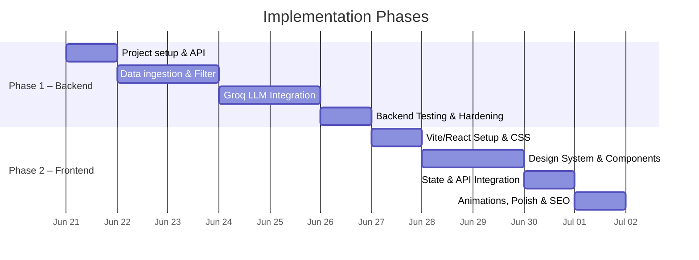
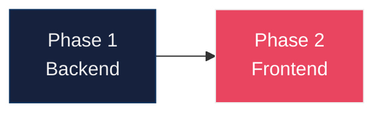

# Implementation Plan: AI-Powered Restaurant Recommendation System

> Phase-wise build plan derived from [architecture.md](./architecture.md) and [context.md](./context.md).
> The plan is divided into 2 distinct phases: **Backend** and **Frontend**. Each sub-phase is self-contained and testable before moving to the next.

---

## Phase Overview

---

## Phase 1 — Backend Implementation

### Objective
Build a robust, scalable backend using Python and FastAPI. This phase handles dataset loading, filtering constraints, interfacing with the Groq LLM, and exposing a REST API for the frontend.

### 1.1 — Project Setup & API Foundation
- **Directory Structure:** Create `src/`, `tests/`, `data/`, and `docs/`.
- **Dependencies:** Install `fastapi`, `uvicorn`, `datasets`, `pandas`, `groq`, `pydantic-settings`.
- **Configuration:** Implement `src/config.py` using `BaseSettings` to load environment variables (e.g., `GROQ_API_KEY`, dataset paths).
- **API Framework:** Scaffold basic FastAPI endpoints in `src/api/routes.py`.

### 1.2 — Data Ingestion & Preprocessing
- **Dataset Loader:** Fetch Zomato dataset from Hugging Face (`ManikaSaini/zomato-restaurant-recommendation`) or load from a local Parquet cache (`src/data/loader.py`).
- **Preprocessor:** Clean missing values, normalize locations, parse cuisines into lists, and derive budget tiers (low, medium, high) based on `cost_for_two` (`src/data/preprocessor.py`).
- **Repository:** Create an in-memory repository for fast O(1) ID lookups and queries (`src/data/repository.py`).

### 1.3 — Filtering & Groq LLM Pipeline
- **Filter Logic:** Implement strict filtering by location, budget, rating, and cuisine. Include fallback relaxation (e.g., dropping cuisine if zero results) (`src/services/filter.py`).
- **Prompt Builder:** Construct system and user prompts injecting user preferences and compact JSON representations of candidate restaurants.
- **Groq Client:** Communicate with the Groq API (e.g., `llama-3.3-70b-versatile`) requesting strict JSON output. Handle retries and fallback models (`src/services/groq_client.py`).
- **Parser & Enricher:** Parse LLM output and enrich it with full restaurant details.

### 1.4 — REST API Integration
- **Endpoints:**
  - `GET /api/locations`: Return list of available cities.
  - `GET /api/cuisines`: Return distinct cuisines.
  - `POST /api/recommend`: Accept `UserPreferences` and return a `RecommendationResponse`.
- **Error Handling:** Implement standard HTTP exception handling and validation errors using Pydantic.

### 1.5 — Backend Hardening & Testing
- **Fallbacks:** Provide a heuristic-based fallback ranking if Groq is unavailable.
- **Logging:** Implement structured logging across data and LLM operations.
- **Tests:** Write unit tests using `pytest` and `pytest-cov` for preprocessing, filtering, and API endpoints.

---

## Phase 2 — Frontend Implementation

### Objective
Develop a premium, high-quality Web Application that delivers a "WOW" factor. The frontend will be built with modern React (via Vite) and styled extensively with Vanilla CSS to maintain maximum flexibility and ensure a highly dynamic user experience.

### 2.1 — Web App Setup & Foundational Styling
- **Initialization:** Scaffold a new React application using Vite (`npx create-vite-app@latest ./ --template react-ts`).
- **Styling Architecture:** Create a core `index.css` implementing a vibrant design system.
  - Use rich, harmonious color palettes (e.g., sleek dark mode with vibrant neon accents).
  - Include modern typography (e.g., Google Fonts like Inter or Outfit).
  - Implement smooth gradients and glassmorphism utilities.
- **Routing:** Set up basic routing (if needed) for Home vs. Results pages.

### 2.2 — Design System & Core Components
- **Components Definition:** Build reusable, highly polished UI components that adhere strictly to the Vanilla CSS design system.
  - **Inputs & Dropdowns:** Custom-styled select boxes and input fields with focus animations.
  - **Buttons:** Interactive buttons with hover/active states, ripples, and smooth transitions.
  - **Cards:** Glassmorphic recommendation cards that elevate on hover with subtle box-shadow transitions.
  - **Loaders:** Dynamic skeleton loaders or engaging micro-animations during API calls (e.g., while Groq is processing).

### 2.3 — Integration & State Management
- **API Client:** Build a fetch/axios service to communicate with the FastAPI backend.
- **State Management:** Manage form state (location, budget, cuisine, rating) and recommendation results using React Context or standard hooks.
- **Error States:** Gracefully handle API errors, empty states, or backend fallbacks with visually appealing error components (no generic browser alerts).

### 2.4 — Polish, Micro-animations & SEO
- **Dynamic Interactions:** Inject life into the application. Add entrance animations for recommendation cards (e.g., stagger effects), hover tooltips, and lively micro-animations for user interactions.
- **Responsive Design:** Ensure the application looks stunning across all device sizes (mobile, tablet, desktop) using CSS media queries and CSS Grid/Flexbox.
- **SEO Best Practices:** Implement proper HTML semantics, `<title>` tags, descriptive meta descriptions, and structured `<h1>`/`<h2>` tags on the page. Use unique IDs for interactive elements.
- **Aesthetic Review:** Conduct a final pass to ensure the interface feels premium, state-of-the-art, and avoids any basic MVP look and feel.

---

## Phase Dependency Graph

> **Note:** Each phase produces testable outputs. Ensure the backend API is fully functional (via Swagger/cURL) before integrating the frontend in Phase 2.

---

## Summary Checklist

| Phase | Key Outcome | Verified By |
|-------|-------------|-------------|
| **1 — Backend** | API serves location data and valid Groq recommendations. | `pytest` and `curl`/FastAPI docs |
| **2 — Frontend** | Web app successfully displays recommendations with premium UI/UX. | Browser verification and Lighthouse scores |

---

## Related Documents

| Document | Description |
|----------|-------------|
| [context.md](./context.md) | Product requirements, workflow, and project context |
| [architecture.md](./architecture.md) | Detailed technical architecture |
| [edge-case.md](./edge-case.md) | Corner scenarios and edge cases |
| [problemStatement.txt](./problemStatement.txt) | Original problem statement |
